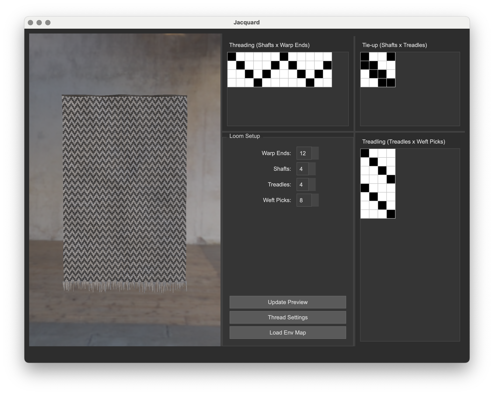
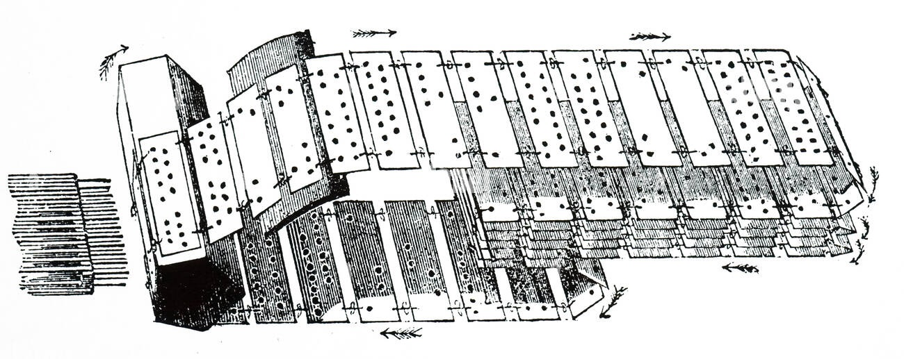

# Jacquard



## Overview

Jacquard is a weaving design software that uses signed distance fields (SDF) with physically-based rendering (PBR) to visualize woven textiles in real-time. 
Jacquard is directly inspired by the historical [Jacquard Machine](https://www.gutenberg.org/files/54193/54193-h/54193-h.htm), a punch-card based device designed by Joseph Marie Jacquard for weaving sophisticated patterns.

## Features

- **Real-time PBR Visualization**: See your fabric design rendered with realistic lighting and materials
- **Weaving Draft System**: Design with the traditional components of a weaving draft:
  - Threading
  - Tie-up
  - Treadling
- **Customizable Loom Parameters**:
  - Number of shafts (up to 64)
  - Treadle count (up to 64)
  - Warp ends (up to 256)
  - Weft picks (up to 256)
- **Material Controls**: Customize thread properties including:
  - Color
  - Roughness and metallic properties
  - Thickness and spacing
  - Subsurface Scattering (useful for silk)
- **Environment Mapping**: Load HDR environment maps for image-based lighting
- **File Management**: Save and load weaving drafts for future editing

## Getting Started

### Installation

This project is configured for macOS only. 

To build from source, please first make sure Qt6 is installed.  

Clone this repo:
```bash
git clone https://github.com/teriyake/jacquard.git jacquard && cd jacquard
```

Run the build script (CMake):
```bash
chmod +x ./build.sh && ./build.sh
```

To run the program from the terminal with console outputs: 
```bash
chmod +x ./run.sh && ./run.sh
```
Alternatively, navigate to `build` and double click `Jacquard.app`.

### Basic Usage

1. **Set Up Your Loom**:
   - In the "Loom Setup" panel, specify the number of warp ends, shafts, treadles, and weft picks for your draft.
   
2. **Design Your Pattern**:
   - Click cells in the Threading grid to assign warp threads to shafts
   - Define the Tie-up by clicking cells to connect shafts to treadles
   - Create your Treadling sequence by clicking cells to determine which treadles are pressed for each weft pick

3. **Visualize Your Fabric**:
   - Click "Update Preview" to see your design rendered in the display panel
   - Use your mouse to rotate the view (left-click and drag)
   - Zoom in/out with the scroll wheel

4. **Customize Thread Properties**:
   - Click "Thread Settings" to open the materials editor
   - Adjust colors, roughness, and other properties
   - Set thread diameter and spacing to match your intended materials

5. **Lighting**:
   - Click "Load Env Map" to select an HDR environment map
   - This provides realistic lighting on your fabric

6. **Save Your Work**:
   - Use File → Save Draft (`Cmd + S`) to save your current design as a Jacquard file (`.jqd`)
   - File → Load Draft (`Cmd + O`) opens saved projects

This repo contains 6 example `.jqd` files under `drafts`.

---


